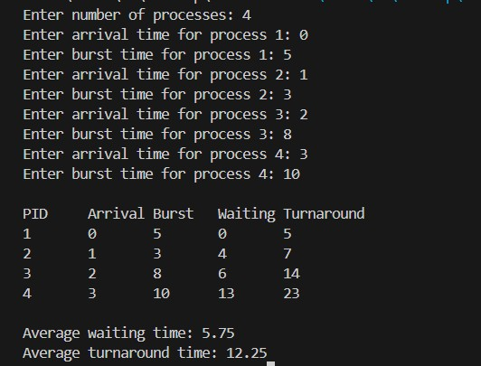

**Submission Date:** September 21, 2025  
**Experiment No:** 01  
**Experiment Name:** Analysis of CPU Scheduling Algorithms: Impact of Arrival Time and CPU Idle Scenarios  

---

## **Theory**
<div align="justify">

CPU scheduling is the method used to decide the order in which processes get access to the CPU. In **non-preemptive CPU scheduling**, once a process starts execution, it runs to completion without being interrupted. To evaluate how well a scheduling algorithm performs, several key metrics are used:

- **Burst Time (BT):** The actual time a process needs to complete on the CPU.

- **Arrival Time (AT):** The moment a process enters the ready queue.

- **Completion Time (CT):** The time at which a process finishes execution.

- **Turnaround Time (TAT):** The total time a process spends in the system, calculated as:  
  \[
  TAT = CT - AT
  \]

- **Waiting Time (WT):** The time a process spends waiting in the ready queue before it starts execution, calculated as:  
  \[
  WT = TAT - BT
  \]

In this lab, we explored non-preemptive scheduling under three different scenarios: **ignoring arrival time**, **considering arrival time**, and **considering arrival time with CPU idle periods**. This helped to understand how the arrival time of processes and the scheduling order can directly affect the waiting and turnaround times of processes.


## **Task 1**  

**Compute average waiting time and turnaround time (ignoring arrival time)**

---

### **C++ Code**
```cpp
#include <iostream>
using namespace std;

int main() {
    int n;
    cout << "Enter number of processes: ";
    cin >> n;

    int burstTime[n];
    int waitingTime[n];
    int turnaroundTime[n];

    cout << "Enter burst time for each processes :\n";
    for (int i = 0; i < n; i++) {
        cout << "Process " << i+1 << ": ";
        cin >> burstTime[i];
    }

  
    waitingTime[0] = 0;
    for (int i = 1; i < n; i++) {
        waitingTime[i] = waitingTime[i-1] + burstTime[i-1];
    }

 
    for (int i = 0; i < n; i++) {
        turnaroundTime[i] = waitingTime[i] + burstTime[i];
    }

    
    double totalWT = 0, totalTAT = 0;
    cout << "\nProcess\tBurst Time\tWaiting Time\tTurnaround Time\n";
    for (int i = 0; i < n; i++) {
        cout << "P" << i+1 << "\t" << burstTime[i] << "\t\t"
             << waitingTime[i] << "\t\t" << turnaroundTime[i] << "\n";
        totalWT += waitingTime[i];
        totalTAT += turnaroundTime[i];
    }

    cout << "\nAverage Waiting Time: " << totalWT/n;
    cout << "\nAverage Turnaround Time: " << totalTAT/n << endl;

    return 0;
}

```
## *Output :* 
<p align="center">

</p>

## **Task 2**  

**Computer average waiting time and turnaround time (consider arrival time)**

---
### **C++ Code**
```cpp

#include <bits/stdc++.h>
using namespace std;

class Process {
public:
    int pid;        
    int arrival;  
    int burst;      
    int waiting;    
    int turnaround; 

    Process() {
        pid = arrival = burst = waiting = turnaround = 0;
    }
};

bool cmpArrival(const Process &a, const Process &b) {
    if (a.arrival == b.arrival) return a.pid < b.pid;
    return a.arrival < b.arrival;
}

int main() {
  

    int n;
    cout << "Enter number of processes: ";
    if (!(cin >> n) || n <= 0) return 0;

    vector<Process> procs(n);

    for (int i = 0; i < n; ++i) {
        procs[i].pid = i + 1;
        cout << "Enter arrival time for process " << procs[i].pid << ": ";
        cin >> procs[i].arrival;
        cout << "Enter burst time for process " << procs[i].pid << ": ";
        cin >> procs[i].burst;
    }

    sort(procs.begin(), procs.end(), cmpArrival);

    int current_time = 0;
    long long total_waiting = 0;
    long long total_turnaround = 0;

    for (int i = 0; i < n; ++i) {
        if (current_time < procs[i].arrival) {
            current_time = procs[i].arrival; 
        }

        procs[i].waiting = current_time - procs[i].arrival;
        int completion_time = current_time + procs[i].burst;
        procs[i].turnaround = completion_time - procs[i].arrival;

        current_time = completion_time;

        total_waiting += procs[i].waiting;
        total_turnaround += procs[i].turnaround;
    }

    cout << "\nPID\tArrival\tBurst\tWaiting\tTurnaround\n";
    for (auto &p : procs) {
        cout << p.pid << "\t" << p.arrival << "\t" << p.burst << "\t"
             << p.waiting << "\t" << p.turnaround << '\n';
    }

    cout << fixed << setprecision(2);
    cout << "\nAverage waiting time: " 
         << (double)total_waiting / n << '\n';
    cout << "Average turnaround time: " 
         << (double)total_turnaround / n << '\n';

    return 0;
}

```
## *Output :* 
<p align="center">

</p>

## **Task 3**  

**Computer average waiting time and turnaround time (consider arrival time & CPU idle)**

---
### **C++ Code**
```cpp

#include <bits/stdc++.h>
using namespace std;

class Process {
public:
    int pid;  
    int arrival;      
    int burst;      
    int waiting;    
    int turnaround; 

    Process() {
        pid = arrival = burst = waiting = turnaround = 0;
    }
};

bool cmpArrival(const Process &a, const Process &b) {
    if (a.arrival == b.arrival) return a.pid < b.pid;
    return a.arrival < b.arrival;
}

int main() {
   
    int n;
    cout << "Enter number of processes: ";
    cin >> n;

    vector<Process> procs(n);

    for (int i = 0; i < n; i++) {
        procs[i].pid = i + 1;
        cout << "Enter arrival time for process " << procs[i].pid << ": ";
        cin >> procs[i].arrival;
        cout << "Enter burst time for process " << procs[i].pid << ": ";
        cin >> procs[i].burst;
    }

  
    sort(procs.begin(), procs.end(), cmpArrival);

    int current_time = 0;
    long long total_waiting = 0, total_turnaround = 0;

    for (int i = 0; i < n; i++) {
       
        if (current_time < procs[i].arrival) {
            current_time = procs[i].arrival;
        }

      
        procs[i].waiting = current_time - procs[i].arrival;

       
        int completion_time = current_time + procs[i].burst;

       
        procs[i].turnaround = completion_time - procs[i].arrival;

       
        current_time = completion_time;

        total_waiting += procs[i].waiting;
        total_turnaround += procs[i].turnaround;
    }

    cout << "\nPID\tArrival\tBurst\tWaiting\tTurnaround\n";
    for (auto &p : procs) {
        cout << p.pid << "\t" << p.arrival << "\t" << p.burst << "\t"
             << p.waiting << "\t" << p.turnaround << "\n";
    }

    cout << fixed << setprecision(2);
    cout << "\nAverage Waiting Time: " 
         << (double)total_waiting / n << "\n";
    cout << "Average Turnaround Time: " 
         << (double)total_turnaround / n << "\n";

    return 0;
}


```
## *Output :* 
<p align="center">

</p>

## *Discussion :*
<div align="justify">
In this lab, I analyzed three CPU scheduling scenarios: without arrival time, with arrival time, and with arrival time including CPU idle periods. The first scenario was straightforward, but the latter two were challenging due to negative waiting times caused by incorrect process order or unhandled idle periods. While I couldn’t fully complete these during the lab, I corrected the logic while preparing this report. This exercise highlighted the importance of properly handling arrival times, accounting for CPU idle periods, and careful debugging in scheduling problems.
</div>