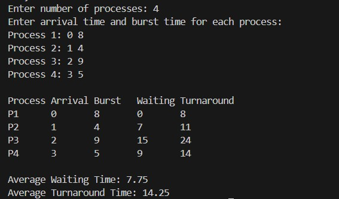
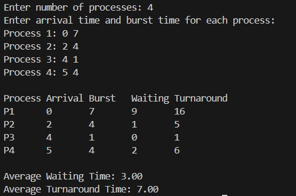

**Submission Date:** October 20, 2025  
**Experiment No:** 02  
**Experiment Name:** Analysis of SJF Scheduling Algorithms: Impact of Arrival Time and CPU Idle Scenarios  

---

## **Theory**
<div align="justify">

The **Shortest Job First (SJF)** algorithm selects the process with the **minimum execution time** to run next. In this scheduling technique, the process that requires the **least burst time** is executed first from the ready queue. If multiple processes share the same burst time, the one with the **smallest alphanumeric identifier** is given priority. This approach helps to **minimize the average waiting time** for other processes in the queue.

SJF can operate in both **preemptive** and **non-preemptive** modes.

* In **non-preemptive SJF**, once a process starts execution, it continues until completion without being interrupted. Any newly arrived process with a shorter burst time must wait in the ready queue.
* In **preemptive SJF**, also known as **Shortest Remaining Time First (SRTF)**, the currently running process can be **interrupted** if a new process arrives with a smaller burst time. The interrupted process is then moved back to the ready queue while the shorter one begins execution.


## **Task 1**  

**Compute average waiting time and turnaround time of SJF (with arrival time, non-preemptive)**

---

### **C++ Code**
```cpp
#include <bits/stdc++.h>
using namespace std;

class Process {
public:
    int id, arrival, burst, start, finish, waiting, turnaround;
};

int main() {
    int n;
    cout << "Enter number of processes: ";
    cin >> n;
    vector<Process> p(n);

    cout << "Enter arrival time and burst time for each process:\n";
    for (int i = 0; i < n; i++) {
        p[i].id = i + 1;
        cout << "Process " << p[i].id << ": ";
        cin >> p[i].arrival >> p[i].burst;
    }

    vector<bool> done(n, false);
    int completed = 0, currentTime = 0;
    double totalWaiting = 0, totalTurnaround = 0;

    while (completed < n) {
        int idx = -1, minBurst = INT_MAX;
        for (int i = 0; i < n; i++) {
            if (!done[i] && p[i].arrival <= currentTime) {
                if (p[i].burst < minBurst || (p[i].burst == minBurst && p[i].id < p[idx].id)) {
                    minBurst = p[i].burst;
                    idx = i;
                }
            }
        }

        if (idx == -1) {
            currentTime++;
            continue;
        }

        p[idx].start = currentTime;
        p[idx].finish = p[idx].start + p[idx].burst;
        p[idx].turnaround = p[idx].finish - p[idx].arrival;
        p[idx].waiting = p[idx].turnaround - p[idx].burst;
        totalWaiting += p[idx].waiting;
        totalTurnaround += p[idx].turnaround;
        currentTime = p[idx].finish;
        done[idx] = true;
        completed++;
    }

    cout << "\nProcess\tArrival\tBurst\tWaiting\tTurnaround\n";
    for (auto &x : p) {
        cout << "P" << x.id << "\t" << x.arrival << "\t" << x.burst << "\t"
             << x.waiting << "\t" << x.turnaround << "\n";
    }

    cout << fixed << setprecision(2);
    cout << "\nAverage Waiting Time: " << totalWaiting / n << endl;
    cout << "Average Turnaround Time: " << totalTurnaround / n << endl;

    return 0;
}


```
## *Output :* 
<p align="center">

</p>

## **Task 2**  

**Compute average waiting time and turnaround time of SJF (with arrival time, preemptive)**

---
### **C++ Code**
```cpp

#include <bits/stdc++.h>
using namespace std;

class Process {
public:
    int id, arrival, burst, remaining, waiting, turnaround, finish;
};

int main() {
    int n;
    cout << "Enter number of processes: ";
    cin >> n;

    vector<Process> p(n);
    cout << "Enter arrival time and burst time for each process:\n";
    for (int i = 0; i < n; i++) {
        p[i].id = i + 1;
        cout << "Process " << p[i].id << ": ";
        cin >> p[i].arrival >> p[i].burst;
        p[i].remaining = p[i].burst;
    }

    int completed = 0, currentTime = 0;
    double totalWaiting = 0, totalTurnaround = 0;

    while (completed < n) {
        int idx = -1, minRemain = INT_MAX;
        for (int i = 0; i < n; i++) {
            if (p[i].arrival <= currentTime && p[i].remaining > 0) {
                if (p[i].remaining < minRemain || 
                   (p[i].remaining == minRemain && (idx == -1 || p[i].id < p[idx].id))) {
                    minRemain = p[i].remaining;
                    idx = i;
                }
            }
        }

        if (idx == -1) {
            currentTime++;
            continue;
        }

        p[idx].remaining--;
        currentTime++;

        if (p[idx].remaining == 0) {
            completed++;
            p[idx].finish = currentTime;
            p[idx].turnaround = p[idx].finish - p[idx].arrival;
            p[idx].waiting = p[idx].turnaround - p[idx].burst;
            totalWaiting += p[idx].waiting;
            totalTurnaround += p[idx].turnaround;
        }
    }

    cout << "\nProcess\tArrival\tBurst\tWaiting\tTurnaround\n";
    for (auto &x : p) {
        cout << "P" << x.id << "\t" << x.arrival << "\t" << x.burst << "\t" 
             << x.waiting << "\t" << x.turnaround << "\n";
    }

    cout << fixed << setprecision(2);
    cout << "\nAverage Waiting Time: " << totalWaiting / n << endl;
    cout << "Average Turnaround Time: " << totalTurnaround / n << endl;

    return 0;
}


```
## *Output :* 
<p align="center">

</p>

## **Task 3**  

**Compute average waiting time and turnaround time of SJF (with arrival time, preemptive, consider CPU idle)**

---
### **C++ Code**
```cpp

#include <bits/stdc++.h>
using namespace std;

class Process {
public:
    int id, arrival, burst, remaining, finish, waiting, turnaround;
};

int main() {
    int n;
    cout << "Enter number of processes: ";
    cin >> n;
    vector<Process> p(n);
    cout << "Enter arrival time and burst time for each process:\n";
    for (int i = 0; i < n; i++) {
        p[i].id = i + 1;
        cout << "Process " << p[i].id << ": ";
        cin >> p[i].arrival >> p[i].burst;
        p[i].remaining = p[i].burst;
    }

    int completed = 0, currentTime = 0;
    double totalWaiting = 0, totalTurnaround = 0;

    while (completed < n) {
        int idx = -1, minRemain = INT_MAX;
        for (int i = 0; i < n; i++) {
            if (p[i].arrival <= currentTime && p[i].remaining > 0) {
                if (p[i].remaining < minRemain || (p[i].remaining == minRemain && (idx == -1 || p[i].id < p[idx].id))) {
                    minRemain = p[i].remaining;
                    idx = i;
                }
            }
        }

        if (idx == -1) {
            currentTime++; 
            continue;
        }

        p[idx].remaining--;
        currentTime++;

        if (p[idx].remaining == 0) {
            completed++;
            p[idx].finish = currentTime;
            p[idx].turnaround = p[idx].finish - p[idx].arrival;
            p[idx].waiting = p[idx].turnaround - p[idx].burst;
            totalWaiting += p[idx].waiting;
            totalTurnaround += p[idx].turnaround;
        }
    }

    cout << "\nProcess\tArrival\tBurst\tWaiting\tTurnaround\n";
    for (auto &x : p) {
        cout << "P" << x.id << "\t" << x.arrival << "\t" << x.burst << "\t"
             << x.waiting << "\t" << x.turnaround << "\n";
    }

    cout << fixed << setprecision(2);
    cout << "\nAverage Waiting Time: " << totalWaiting / n << endl;
    cout << "Average Turnaround Time: " << totalTurnaround / n << endl;

    return 0;
}


```
## *Output :* 
<p align="center">

</p>

## *Discussion :*
<div align="justify">
In this lab, I worked on three CPU scheduling scenarios: without arrival times, with arrival times, and with arrival times including CPU idle periods. The first was straightforward, but the latter two were tricky due to negative waiting times and mishandled idle periods. While I couldn’t fully complete them during the lab, I corrected the logic while preparing this report. This highlighted the importance of handling arrival times carefully, accounting for CPU idle time, and thorough debugging in scheduling problems.
</div>