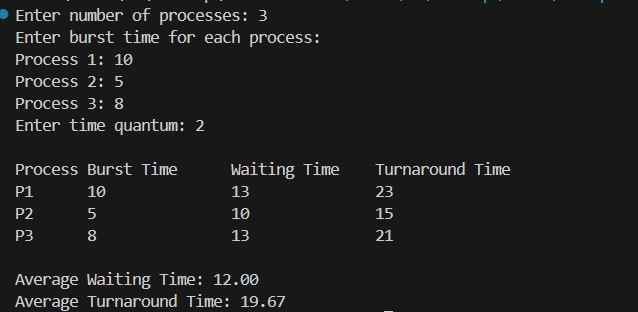
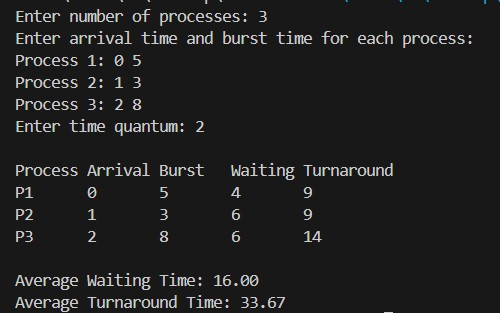
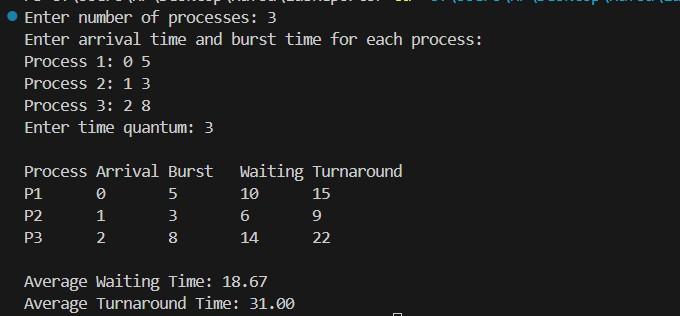

**Submission Date:** November 09, 2025  
**Experiment No:** 03  
**Experiment Name:** Study of Round Robin Scheduling method. 

---

## **Theory**
<div align="justify">

Round Robin is a CPU scheduling algorithm that allocates a fixed time slice to each process in a cyclic order. During every cycle, each process gets a specific time period to execute. If a process does not finish within its allotted time, it is paused, and its current state is saved. The CPU is then given to the next process in the queue. In the following cycle, the paused process resumes from where it was left off. This scheduling method is preemptive in nature.


## **Task 1**  

**Compute average waiting time and average turnaround time for Round Robin Scheduling (without arrival time).**

---

### **C++ Code**
```cpp
#include <bits/stdc++.h>
using namespace std;

class Process {
public:
    int id, burst, remaining, waiting, turnaround, finish;
};

int main() {
    int n, quantum;
    cout << "Enter number of processes: ";
    cin >> n;

    vector<Process> p(n);

    cout << "Enter burst time for each process:\n";
    for (int i = 0; i < n; i++) {
        p[i].id = i + 1;
        cout << "Process " << p[i].id << ": ";
        cin >> p[i].burst;
        p[i].remaining = p[i].burst;
        p[i].waiting = 0;
        p[i].turnaround = 0;
        p[i].finish = 0;
    }

    cout << "Enter time quantum: ";
    cin >> quantum;

    int currentTime = 0;
    bool done;

 
    while (true) {
        done = true;
        for (int i = 0; i < n; i++) {
            if (p[i].remaining > 0) {
                done = false;

                if (p[i].remaining > quantum) {
                    currentTime += quantum;
                    p[i].remaining -= quantum;
                } else {
                    currentTime += p[i].remaining;
                    p[i].remaining = 0;
                    p[i].finish = currentTime;
                    p[i].turnaround = p[i].finish;
                    p[i].waiting = p[i].turnaround - p[i].burst;
                }
            }
        }

        if (done)
            break;
    }

    double totalWaiting = 0, totalTurnaround = 0;

    cout << "\nProcess\tBurst Time\tWaiting Time\tTurnaround Time\n";
    for (auto &x : p) {
        cout << "P" << x.id << "\t" << x.burst << "\t\t"
             << x.waiting << "\t\t" << x.turnaround << "\n";
        totalWaiting += x.waiting;
        totalTurnaround += x.turnaround;
    }

    cout << fixed << setprecision(2);
    cout << "\nAverage Waiting Time: " << totalWaiting / n;
    cout << "\nAverage Turnaround Time: " << totalTurnaround / n << endl;

    return 0;
}

```
## *Output :* 
<p align="center">

</p>

## **Task 2**  

**Compute average waiting time and average turnaround time for Round Robin Scheduling (with arrival time).**

---
### **C++ Code**
```cpp

#include <bits/stdc++.h>
using namespace std;

class Process {
public:
    int id, arrival, burst, remaining, waiting = 0, turnaround = 0, finish = 0;
};

int main() {
    int n, quantum;
    cout << "Enter number of processes: ";
    cin >> n;

    vector<Process> p(n);
    cout << "Enter arrival time and burst time for each process:\n";
    for (int i = 0; i < n; i++) {
        p[i].id = i + 1;
        cout << "Process " << p[i].id << ": ";
        cin >> p[i].arrival >> p[i].burst;
        p[i].remaining = p[i].burst;
    }

    cout << "Enter time quantum: ";
    cin >> quantum;

    queue<int> q;
    vector<bool> inQueue(n, false);
    int currentTime = 0, completed = 0;
    double totalWaiting = 0, totalTurnaround = 0;

  
    sort(p.begin(), p.end(), [](Process &a, Process &b) {
        return a.arrival < b.arrival;
    });

    q.push(0);
    inQueue[0] = true;
    currentTime = p[0].arrival;

    while (!q.empty()) {
        int i = q.front();
        q.pop();
        inQueue[i] = false;

        if (p[i].remaining > quantum) {
            currentTime += quantum;
            p[i].remaining -= quantum;
        } else {
            currentTime += p[i].remaining;
            p[i].remaining = 0;
            p[i].finish = currentTime;
            p[i].turnaround = p[i].finish - p[i].arrival;
            p[i].waiting = p[i].turnaround - p[i].burst;
            totalWaiting += p[i].waiting;
            totalTurnaround += p[i].turnaround;
            completed++;
        }

       
        for (int j = 0; j < n; j++) {
            if (p[j].arrival <= currentTime && p[j].remaining > 0 && !inQueue[j]) {
                q.push(j);
                inQueue[j] = true;
            }
        }

       
        if (p[i].remaining > 0) {
            q.push(i);
            inQueue[i] = true;
        }

       
        if (q.empty()) {
            for (int j = 0; j < n; j++) {
                if (p[j].remaining > 0) {
                    currentTime = max(currentTime, p[j].arrival);
                    q.push(j);
                    inQueue[j] = true;
                    break;
                }
            }
        }
    }

    cout << "\nProcess\tArrival\tBurst\tWaiting\tTurnaround\n";
    for (auto &x : p) {
        cout << "P" << x.id << "\t" << x.arrival << "\t" << x.burst << "\t"
             << x.waiting << "\t" << x.turnaround << "\n";
    }

    cout << fixed << setprecision(2);
    cout << "\nAverage Waiting Time: " << totalWaiting / n << endl;
    cout << "Average Turnaround Time: " << totalTurnaround / n << endl;

    return 0;
}


```
## *Output :* 
<p align="center">

</p>

## **Task 3**  

**Compute average waiting time and average turnaround time for Round Robin Scheduling (with arrival time).(consider overhead=1)**

---
### **C++ Code**
```cpp

#include <bits/stdc++.h>
using namespace std;

class Process {
public:
    int id, arrival, burst, remaining, waiting = 0, turnaround = 0, finish = 0;
};

int main() {
    int n, quantum, overhead = 1;
    cout << "Enter number of processes: ";
    cin >> n;

    vector<Process> p(n);

    cout << "Enter arrival time and burst time for each process:\n";
    for (int i = 0; i < n; i++) {
        p[i].id = i + 1;
        cout << "Process " << p[i].id << ": ";
        cin >> p[i].arrival >> p[i].burst;
        p[i].remaining = p[i].burst;
    }

    cout << "Enter time quantum: ";
    cin >> quantum;

    
    sort(p.begin(), p.end(), [](Process &a, Process &b) {
        return a.arrival < b.arrival;
    });

    queue<int> q;
    vector<bool> inQueue(n, false);
    int currentTime = 0, completed = 0;
    double totalWaiting = 0, totalTurnaround = 0;

 
    q.push(0);
    inQueue[0] = true;
    currentTime = p[0].arrival;

    while (!q.empty()) {
        int i = q.front();
        q.pop();
        inQueue[i] = false;

        if (p[i].remaining > quantum) {
            currentTime += quantum;
            p[i].remaining -= quantum;
        } else {
            currentTime += p[i].remaining;
            p[i].remaining = 0;
            p[i].finish = currentTime;
            p[i].turnaround = p[i].finish - p[i].arrival;
            p[i].waiting = p[i].turnaround - p[i].burst;
            totalWaiting += p[i].waiting;
            totalTurnaround += p[i].turnaround;
            completed++;
        }

        currentTime += overhead;

    
        for (int j = 0; j < n; j++) {
            if (p[j].arrival <= currentTime && p[j].remaining > 0 && !inQueue[j]) {
                q.push(j);
                inQueue[j] = true;
            }
        }

        
        if (p[i].remaining > 0) {
            q.push(i);
            inQueue[i] = true;
        }

     
        if (q.empty()) {
            for (int j = 0; j < n; j++) {
                if (p[j].remaining > 0) {
                    currentTime = max(currentTime, p[j].arrival);
                    q.push(j);
                    inQueue[j] = true;
                    break;
                }
            }
        }
    }

    cout << "\nProcess\tArrival\tBurst\tWaiting\tTurnaround\n";
    for (auto &x : p) {
        cout << "P" << x.id << "\t" << x.arrival << "\t"
             << x.burst << "\t" << x.waiting << "\t"
             << x.turnaround << "\n";
    }

    cout << fixed << setprecision(2);
    cout << "\nAverage Waiting Time: " << totalWaiting / n;
    cout << "\nAverage Turnaround Time: " << totalTurnaround / n << endl;

    return 0;
}


```
## *Output :* 
<p align="center">

</p>

## *Discussion :*
<div align="justify">
In this experiment, we have studied the Round Robin Scheduling method. We have considered the same
time laps for all the processes. We have also calculated the average waiting time and average turn around
time. We have also calculated the response time for each process.
</div>