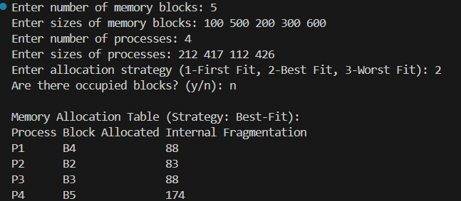
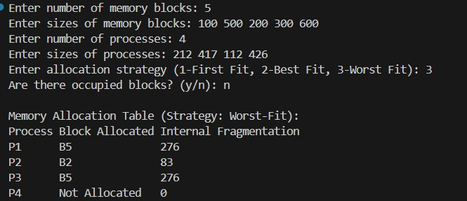

**Submission Date:** November 07, 2025  
**Experiment No:** 05  
**Experiment Name:** Study of Memory Allocation Algorithm. 

---

## **Theory**
<div align="justify">

### **Contiguous Memory Allocation**

Contiguous memory allocation is a method used in operating systems to assign consecutive memory blocks to processes. Three common strategies are First-Fit, Best-Fit, and Worst-Fit. In First-Fit, a process is allocated the first available block large enough to hold it. Best-Fit searches for the smallest suitable block to minimize wasted space, while Worst-Fit chooses the largest available block to leave medium-sized blocks free for future processes. These algorithms help manage both fixed-size partitions and variable-size memory, reduce fragmentation, and ensure efficient utilization of memory resources. Internal fragmentation occurs when allocated memory exceeds the process’s requirement, and the unused portion remains wasted within the block.

---

## **Task 1**  

**Contiguous Memory Allocation Algorithm**

---

### **C++ Code**
```cpp

#include <bits/stdc++.h>
using namespace std;

void allocateMemory(vector<int> blocks, vector<int> processes, int strategy, vector<bool> occupied = {}) {
    int n = blocks.size();
    int m = processes.size();
    vector<int> allocation(m, -1);
    vector<int> remaining = blocks;

    if(occupied.size() != n) occupied.assign(n, false);
    for(int i = 0; i < n; i++) if(occupied[i]) remaining[i] = 0;

    for(int i = 0; i < m; i++) {
        int idx = -1;
        if(strategy == 1) { 
            for(int j = 0; j < n; j++) {
                if(!occupied[j] && remaining[j] >= processes[i]) {
                    idx = j; break;
                }
            }
        } else if(strategy == 2) { 
            for(int j = 0; j < n; j++) {
                if(!occupied[j] && remaining[j] >= processes[i]) {
                    if(idx == -1 || remaining[j] < remaining[idx]) idx = j;
                }
            }
        } else if(strategy == 3) { 
            for(int j = 0; j < n; j++) {
                if(!occupied[j] && remaining[j] >= processes[i]) {
                    if(idx == -1 || remaining[j] > remaining[idx]) idx = j;
                }
            }
        }

        if(idx != -1) {
            allocation[i] = idx;
            remaining[idx] -= processes[i];
        }
    }

    cout << "\nMemory Allocation Table (Strategy: ";
    if(strategy==1) cout<<"First-Fit):\n";
    else if(strategy==2) cout<<"Best-Fit):\n";
    else cout<<"Worst-Fit):\n";

    cout << "Process\tBlock Allocated\tInternal Fragmentation\n";
    for(int i = 0; i < m; i++) {
        cout << "P" << i+1 << "\t";
        if(allocation[i] != -1) {
            cout << "B" << allocation[i]+1 << "\t\t" << remaining[allocation[i]] << "\n";
        } else cout << "Not Allocated\t0\n";
    }
}

int main() {
    int n, m;
    cout << "Enter number of memory blocks: ";
    cin >> n;
    vector<int> blocks(n);
    cout << "Enter sizes of memory blocks: ";
    for(int i=0;i<n;i++) cin >> blocks[i];

    cout << "Enter number of processes: ";
    cin >> m;
    vector<int> processes(m);
    cout << "Enter sizes of processes: ";
    for(int i=0;i<m;i++) cin >> processes[i];

    int strategy;
    cout << "Enter allocation strategy (1-First Fit, 2-Best Fit, 3-Worst Fit): ";
    cin >> strategy;


    vector<bool> occupied(n, false);
    char varChoice;
    cout << "Are there occupied blocks? (y/n): ";
    cin >> varChoice;
    if(varChoice == 'y' || varChoice == 'Y') {
        int k;
        cout << "Enter number of occupied blocks: ";
        cin >> k;
        cout << "Enter occupied block numbers (1-based index): ";
        for(int i = 0; i < k; i++) {
            int b;
            cin >> b;
            occupied[b-1] = true;
        }
    }

    allocateMemory(blocks, processes, strategy, occupied);
    return 0;
}


```
## *Output :*
<p align="center">



</p>


## *Discussion :*
<div align="justify">
In this experiment, we studied Contiguous Memory Allocation using First-Fit, Best-Fit, and Worst-Fit strategies. These algorithms are used to allocate memory blocks to processes in an efficient manner while minimizing fragmentation. First-Fit allocates the first available memory block large enough for a process, Best-Fit selects the smallest suitable block to reduce wasted space, and Worst-Fit allocates the largest available block to leave medium-sized blocks free for future processes. Through this experiment, we analyzed memory allocation tables, internal fragmentation, and allocation success rates for different strategies. The results demonstrated how different allocation techniques impact memory utilization and process accommodation, highlighting trade-offs between speed, fragmentation, and efficient use of available memory in operating systems.
</div>