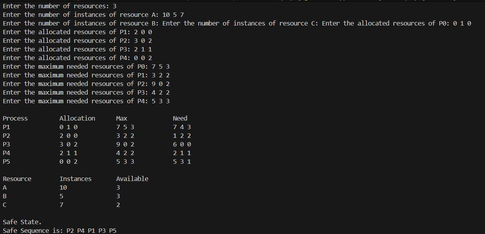

**Submission Date:** November 23, 2025  
**Experiment No:** 04  
**Experiment Name:** Study of Banker's Algorithms. 

---

## **Theory**
<div align="justify">

### **Banker's Algorithm**

Banker's Algorithm is a **resource allocation and deadlock avoidance** algorithm that tests for safety by simulating the allocation for predetermined maximum possible amounts of all resources. It then performs an **"s-state" check** to determine whether all processes can complete, before deciding whether allocation should be allowed to continue.

The Banker's Algorithm is named after **Edsger Dijkstra**, who published the algorithm in 1965. It is also known as the **detection algorithm**, because it determines whether the system is in a **safe state** or not.

There are **two types** of Banker's Algorithm:

1. **Safety Algorithm** – Checks if the system is currently in a safe state.
2. **Resource Request Algorithm** – Checks whether a resource request from a process can be safely granted.

---

## **Task 1**  

**Safety Algorithm for Banker's Algorithm**

---

### **C++ Code**
```cpp

#include <bits/stdc++.h>
using namespace std;
const int N = 15;
int n, m, Max[N][N], need[N][N], allocation[N][N], instance[N],
available[N], done[N], work[N];
bool isok(int i) {
for (int j = 0; j < m; j++) {
if (need[i][j] > work[j]) return 0;
}
return 1;
}
int main () {
printf("Enter the number processes: ");
cin >> n;
printf("Enter the number resources: ");
cin >> m;
for (int i = 0; i < m; i++) {
printf("Enter the number of instances of resource %c: ", 'A' + i);
cin >> instance[i];
}
for (int i = 0; i < n; i++) {
printf("Enter the allocated resources of P%d: ", i);
for (int j = 0; j < m; j++) cin >> allocation[i][j];
}
for (int i = 0; i < n; i++) {
printf("Enter the number of maximum needed resources of P%d: ",
i);
for (int j = 0; j < m; j++) cin >> Max[i][j];
}
// need calculation
for (int i = 0; i < n; i++) {
for (int j = 0; j < m; j++) {
need[i][j] = Max[i][j] - allocation[i][j];
}
}
//available calculation
for (int i = 0; i < m; i++) {
available[i] = instance[i];
for (int j = 0; j < n; j++) {
available[i] -= allocation[j][i];
}
work[i] = available[i];
}
//safety algorithm
vector <int> safe_sequence;
while (1) {
int k = -1;
for (int i = 0; i < n; i++) {
if (!done[i] and isok(i)) {
k = i;
break;
}
}
if (k == -1) break;
safe_sequence.push_back(k);
done[k] = 1;
for (int i = 0; i < m; i++) work[i] += allocation[k][i];
}
printf("\nProcess \t Allocation \t Max \t\t Need\n");
for (int i = 0; i < n; i++) {
printf("P%d \t\t", i + 1);
for (int j = 0; j < m; j++) {
printf("%d ", allocation[i][j]);
}
printf("\t\t");
for (int j = 0; j < m; j++) {
printf("%d ", Max[i][j]);
}
printf("\t\t");
for (int j = 0; j < m; j++) {
printf("%d ", need[i][j]);
}
printf("\n");
}
printf("\nRes. \t Ins \t Available\n");
for (int i = 0; i < m; i++) {
printf("%c \t %d \t %d\n", i + 'A', instance[i], available[i]);
}
if (!count(done, done + n, 0)) {
printf("\nSafe State.\nSafe Sequence is: ");
for (int x : safe_sequence) printf("P%d ", ++x);
printf("\n");
}
else printf("\nNot in safe state\n");
return 0;
}

```
## *Output :*
<p align="center">

</p>

## **Task 2**  

**Resource Request Algorithm.**

---
### **C++ Code**
```cpp

#include <bits/stdc++.h>
using namespace std;
const int N = 15;
int n, m, Max[N][N], need[N][N], allocation[N][N], instance[N],
available[N], done[N], work[N];
bool isok(int i) {
for (int j = 0; j < m; j++) {
if (need[i][j] > work[j]) return 0;
}
return 1;
}
int main () {
printf("Enter the number processes: ");
cin >> n;
printf("Enter the number resources: ");
cin >> m;
for (int i = 0; i < m; i++) {
printf("Enter the number of instances of resource %c: ", 'A' + i);
cin >> instance[i];
}
for (int i = 0; i < n; i++) {
printf("Enter the allocated resources of P%d: ", i);
for (int j = 0; j < m; j++) cin >> allocation[i][j];
}
for (int i = 0; i < n; i++) {
printf("Enter the number of maximum needed resources of P%d: ",
i);
for (int j = 0; j < m; j++) cin >> Max[i][j];
}
// need calculation
for (int i = 0; i < n; i++) {
for (int j = 0; j < m; j++) {
need[i][j] = Max[i][j] - allocation[i][j];
}
}
//available calculation
for (int i = 0; i < m; i++) {
available[i] = instance[i];
for (int j = 0; j < n; j++) {
available[i] -= allocation[j][i];
}
work[i] = available[i];
}
printf("Enter the process number which needed more resources: ");
int ti; cin >> ti;
printf("Enter the number of extra needed resources of P%d: ", ti);
for (int j = 0; j < m; j++) {
int y; cin >> y;
if(available[j] < y) {
printf("\nGone to unsafe state\n");
return 0;
}
allocation[ti][j] += y;
need[ti][j] -= y;
available[j] -= y;
}
//safety algorithm
vector <int> safe_sequence;
while (1) {
int k = -1;
for (int i = 0; i < n; i++) {
if (!done[i] and isok(i)) {
k = i;
break;
}
}
if (k == -1) break;
safe_sequence.push_back(k);
done[k] = 1;
for (int i = 0; i < m; i++) work[i] += allocation[k][i];
}
printf("\nProcess \t Allocation \t Max \t\t Need\n");
for (int i = 0; i < n; i++) {
printf("P%d \t\t", i + 1);
for (int j = 0; j < m; j++) {
printf("%d ", allocation[i][j]);
}
printf("\t\t");
for (int j = 0; j < m; j++) {
printf("%d ", Max[i][j]);
}
printf("\t\t");
for (int j = 0; j < m; j++) {
printf("%d ", need[i][j]);
}
printf("\n");
}
printf("\nRes. \t Ins \t Available\n");
for (int i = 0; i < m; i++) {
printf("%c \t %d \t %d\n", i + 'A', instance[i], available[i]);
}
if (!count(done, done + n, 0)) {
printf("\nSafe State.\nSafe Sequence is: ");
for (int x : safe_sequence) printf("P%d ", ++x);
printf("\n");
}
else printf("\nNot in safe state\n");
return 0;
}


```
## *Output :* 
<p align="center">

</p>


## *Discussion :*
<div align="justify">
In the above code, we have used the safety algorithm to check whether the current state is safe or not. If it
is safe, then we will ask the user to enter the process number which needed more resources. After that, we
will ask the user to enter the number of extra needed resources of that process. After that, we will check
whether the current state is safe or not. If it is safe, then we will print the current state. Otherwise, we will
print that the current state is unsafe.
</div>