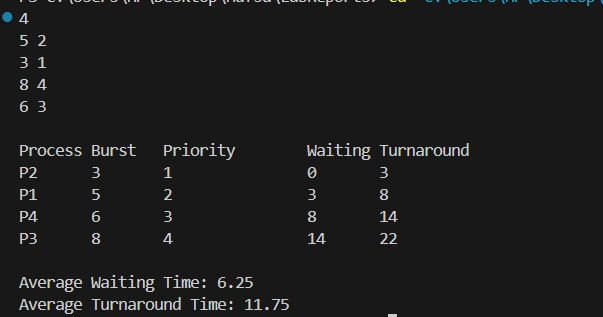

**Submission Date:** November 23, 2025  
**Experiment No:** 04  
**Experiment Name:** Study of Banker's Algorithms & Priority Scheduling Algorithm. 

---

## **Theory**
<div align="justify">

### **Banker's Algorithm**

Banker's Algorithm is a **resource allocation and deadlock avoidance** algorithm that tests for safety by simulating the allocation for predetermined maximum possible amounts of all resources. It then performs an **"s-state" check** to determine whether all processes can complete, before deciding whether allocation should be allowed to continue.

The Banker's Algorithm is named after **Edsger Dijkstra**, who published the algorithm in 1965. It is also known as the **detection algorithm**, because it determines whether the system is in a **safe state** or not.

There are **two types** of Banker's Algorithm:

1. **Safety Algorithm** – Checks if the system is currently in a safe state.
2. **Resource Request Algorithm** – Checks whether a resource request from a process can be safely granted.

---

### **Priority Scheduling Algorithm**

Priority Scheduling is a **CPU scheduling algorithm** where each process is assigned a **priority**. The CPU is allocated to the process with the **highest priority** (usually the lowest numerical value indicates the highest priority).

* **Types:**

  1. **Preemptive Priority Scheduling** – A running process can be preempted if a higher priority process arrives.
  2. **Non-Preemptive Priority Scheduling** – The currently running process continues until it finishes, even if a higher priority process arrives.

* **Key Terms:**

  * **Waiting Time** – Time a process spends waiting in the ready queue.
  * **Turnaround Time** – Total time taken from arrival to completion of a process.

Priority Scheduling is commonly used in **real-time systems**, where certain tasks must be executed before others.


## **Task 1**  

**Safety Algorithm for Banker's Algorithm**

---

### **C++ Code**
```cpp

#include <bits/stdc++.h>
using namespace std;
const int N = 15;
int n, m, Max[N][N], need[N][N], allocation[N][N], instance[N],
available[N], done[N], work[N];
bool isok(int i) {
for (int j = 0; j < m; j++) {
if (need[i][j] > work[j]) return 0;
}
return 1;
}
int main () {
printf("Enter the number processes: ");
cin >> n;
printf("Enter the number resources: ");
cin >> m;
for (int i = 0; i < m; i++) {
printf("Enter the number of instances of resource %c: ", 'A' + i);
cin >> instance[i];
}
for (int i = 0; i < n; i++) {
printf("Enter the allocated resources of P%d: ", i);
for (int j = 0; j < m; j++) cin >> allocation[i][j];
}
for (int i = 0; i < n; i++) {
printf("Enter the number of maximum needed resources of P%d: ",
i);
for (int j = 0; j < m; j++) cin >> Max[i][j];
}
// need calculation
for (int i = 0; i < n; i++) {
for (int j = 0; j < m; j++) {
need[i][j] = Max[i][j] - allocation[i][j];
}
}
//available calculation
for (int i = 0; i < m; i++) {
available[i] = instance[i];
for (int j = 0; j < n; j++) {
available[i] -= allocation[j][i];
}
work[i] = available[i];
}
//safety algorithm
vector <int> safe_sequence;
while (1) {
int k = -1;
for (int i = 0; i < n; i++) {
if (!done[i] and isok(i)) {
k = i;
break;
}
}
if (k == -1) break;
safe_sequence.push_back(k);
done[k] = 1;
for (int i = 0; i < m; i++) work[i] += allocation[k][i];
}
printf("\nProcess \t Allocation \t Max \t\t Need\n");
for (int i = 0; i < n; i++) {
printf("P%d \t\t", i + 1);
for (int j = 0; j < m; j++) {
printf("%d ", allocation[i][j]);
}
printf("\t\t");
for (int j = 0; j < m; j++) {
printf("%d ", Max[i][j]);
}
printf("\t\t");
for (int j = 0; j < m; j++) {
printf("%d ", need[i][j]);
}
printf("\n");
}
printf("\nRes. \t Ins \t Available\n");
for (int i = 0; i < m; i++) {
printf("%c \t %d \t %d\n", i + 'A', instance[i], available[i]);
}
if (!count(done, done + n, 0)) {
printf("\nSafe State.\nSafe Sequence is: ");
for (int x : safe_sequence) printf("P%d ", ++x);
printf("\n");
}
else printf("\nNot in safe state\n");
return 0;
}

```
## *Output :*
<p align="center">

</p>

## **Task 2**  

**Priority Scheduling Algorithm(non-preemptive).**

---
### **C++ Code**
```cpp

#include <bits/stdc++.h>
using namespace std;

struct Process {
    int pid;
    int burst;
    int priority;
    int waiting;
    int turnaround;
};

int main() {
    int n;
    cin >> n;

    vector<Process> p(n);
    for (int i = 0; i < n; i++) {
        p[i].pid = i + 1;
        cin >> p[i].burst >> p[i].priority;
    }

    sort(p.begin(), p.end(), [](Process a, Process b) {
        return a.priority < b.priority;
    });

    int totalWaiting = 0, totalTurnaround = 0;
    p[0].waiting = 0;
    p[0].turnaround = p[0].burst;
    totalTurnaround += p[0].turnaround;

    for (int i = 1; i < n; i++) {
        p[i].waiting = p[i-1].waiting + p[i-1].burst;
        p[i].turnaround = p[i].waiting + p[i].burst;
        totalWaiting += p[i].waiting;
        totalTurnaround += p[i].turnaround;
    }

    cout << "\nProcess\tBurst\tPriority\tWaiting\tTurnaround\n";
    for (auto &proc : p) {
        cout << "P" << proc.pid << "\t" << proc.burst << "\t"
             << proc.priority << "\t\t" << proc.waiting << "\t"
             << proc.turnaround << "\n";
    }

    cout << fixed << setprecision(2);
    cout << "\nAverage Waiting Time: " << (double)totalWaiting / n;
    cout << "\nAverage Turnaround Time: " << (double)totalTurnaround / n << endl;

    return 0;
}


```
## *Output :* 
<p align="center">

</p>


## *Discussion :*
<div align="justify">
In this experiment, we studied Banker's Algorithm and Priority Scheduling. Banker's Algorithm is used for deadlock avoidance by checking if resource allocation keeps the system in a safe state, allowing all processes to complete without conflicts. Priority Scheduling is a CPU scheduling algorithm where processes are executed based on their priority, with higher-priority processes receiving CPU time first, which affects waiting and turnaround times. Through these experiments, we analyzed safe sequences, waiting times, and turnaround times, demonstrating how these algorithms manage resources and process execution efficiently in operating systems.
</div>